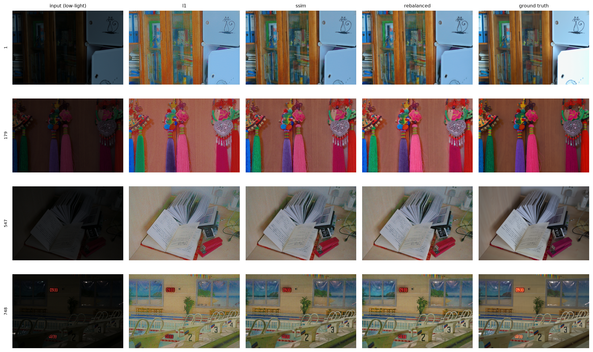

# Retinex-Net in PyTorch — what actually improves it?

A from-scratch PyTorch reimplementation of **Retinex-Net** (Wei et al., BMVC
2018), verified against the authors' released TensorFlow weights, plus four
controlled experiments on the loss: an SSIM reconstruction term, learned loss
weights, a fixed-weight control, and the paper's BM3D denoising step —
evaluated in-distribution **and across three unseen datasets**, which the
original paper compares only with pictures.

**Headline.** Separating the loss change from the denoising step changes what
the result means. On LOL, ~85% of what the SSIM loss bought is reproduced by
simply running BM3D — once every model is denoised they are nearly
interchangeable. **Cross-dataset, none of it is** : the gap survives denoising
intact, so that is where the loss change actually earns its keep, and it is the
evaluation the original paper reports only as side-by-side pictures.

Two secondary results. Learning the loss weights by homoscedastic uncertainty
converges to `1.00 : 0.65 : 0.70` and beats the paper — but a *fixed* config at
those same ratios matches or beats the learned one, so the method found the
weights rather than needing to learn them. And the paper's BM3D step improves
NIQE in-distribution, including on held-out images, yet **a denoising strength
fitted to LOL does not transfer to other datasets** — a domain-shift failure,
not overfitting.

---

## Results

The experiment is a 2&times;4 factorial: **reconstruction loss** &times; **denoising on/off**.
Denoising is a post-process available to any of these models, so mixing denoised and
undenoised rows into one ranking would confound *which loss* with *was it denoised*.
Full table with every metric, plus the Decom-Net variants, in
[`outputs/results_table.md`](outputs/results_table.md).

**Protocol.** LOL `eval15` is paired, so it carries full-reference metrics
(PSNR / SSIM / LPIPS-Alex). LIME / MEF / DICM are unpaired and unseen during
training, so they carry NIQE only — which is why the identity row is reported:
a no-reference score is uninterpretable without it. SSIM is RGB and
channel-averaged; the luma variant, which is what the 0.560 usually quoted for
Retinex-Net refers to, differs by ~0.12 and is in the full table.

### A. Loss function, no denoising

| Model | LOL PSNR &uarr; | LOL SSIM &uarr; | LOL LPIPS &darr; | LIME NIQE &darr; | MEF NIQE &darr; | DICM NIQE &darr; |
|:---|:---:|:---:|:---:|:---:|:---:|:---:|
| *Identity (no enhancement)* | 7.77 | 0.1952 | 0.5595 | 4.35 | 5.19 | 3.86 |
| *Wei et al. released weights* | 16.79 | 0.4189 | 0.4740 | 4.62 | 5.17 | 4.53 |
| **L1 recon** — the paper | 18.26 | 0.5949 | 0.4421 | 5.03 | 4.87 | 4.12 |
| **L1 + SSIM** | 18.68 | 0.7222 | 0.2651 | 4.24 | 3.74 | 3.05 |
| **L1 + SSIM, uncertainty-weighted** | 19.05 | 0.7542 | 0.2215 | **3.94** | 3.50 | **2.69** |
| **L1 + SSIM, fixed 1.00 : 0.65 : 0.70** | **19.11** | **0.7627** | **0.2055** | 4.00 | **3.47** | **2.69** |

### B. Same four models, with BM3D on reflectance

&sigma; and &gamma; tuned per model on training pairs, never on an evaluation set.

| Model | LOL PSNR &uarr; | LOL SSIM &uarr; | LOL LPIPS &darr; | LIME NIQE &darr; | MEF NIQE &darr; | DICM NIQE &darr; |
|:---|:---:|:---:|:---:|:---:|:---:|:---:|
| **L1 recon** — the paper | 18.54 | 0.7734 | 0.2323 | 5.15 | 5.53 | 4.42 |
| **L1 + SSIM** | 18.79 | **0.7910** | **0.1900** | 4.47 | 3.91 | 3.21 |
| **L1 + SSIM, uncertainty-weighted** | 19.07 | 0.7717 | 0.2059 | **4.09** | 3.59 | 2.76 |
| **L1 + SSIM, fixed 1.00 : 0.65 : 0.70** | **19.13** | 0.7773 | 0.1947 | **4.09** | **3.51** | **2.71** |

### How much of the loss effect is just noise suppression?

| Metric | spread without BM3D | spread with BM3D | absorbed |
|:---|:---:|:---:|:---:|
| LOL LPIPS &darr; | 0.2366 | 0.0423 | **+82%** |
| LOL SSIM &uarr; | 0.1678 | 0.0192 | **+89%** |
| cross-dataset NIQE &darr; | 1.2936 | 1.5976 | **-24%** |

**This is the finding the split makes visible.** On LOL, a generic denoiser
reproduces ~85% of what the loss change bought — once every model is denoised
they are close to interchangeable, and the LPIPS ranking even reorders.
Cross-dataset the spread does not collapse at all. So the SSIM term's
**in-distribution advantage is largely noise suppression**, which BM3D also
provides; its **out-of-distribution advantage is something else**, and it
survives denoising.

That makes the cross-dataset column the one that actually justifies the loss
change — and it is exactly the column the original paper reports only as
side-by-side pictures.



*LOL eval15, evenly-spaced sample (not hand-picked). More grids, including the
BM3D effect, in [`outputs/qualitative/`](outputs/qualitative/).*

---

## Technique

**Decom-Net** splits an image into 3-channel reflectance `R` and 1-channel
illumination `I`, both sigmoid-bounded, so `S ≈ R · I`. Shared weights process
the low- and normal-light image of a pair; the pairing enters only through the
loss. **Enhance-Net** takes the frozen low-light decomposition and predicts an
enhanced illumination map `Î`, output `R_low · Î` — encoder-decoder with
stride-2 down-sampling, resize-convolution up-sampling (not transposed conv),
additive skips (not concatenation), and multi-scale fusion of all three decoder
scales. 445K parameters.

The term that makes the decomposition work is a structure-aware smoothness
penalty, `mean(|∇I| · exp(−λ_g·|∇R|))`. Plain total variation is
structure-blind and smooths across object boundaries, leaving their edges baked
into the illumination map; the exponential weight releases the penalty exactly
where reflectance has a strong edge.

**The four loss configurations** differ only in the Enhance-Net reconstruction
loss, over a shared frozen Decom-Net, same seed, same 100-epoch budget:

```
L = w_l1·‖R_low·Î − S_normal‖₁ + w_ssim·(1 − SSIM(R_low·Î, S_normal)) + w_sm·L_is(Î, R_low)
```

| configuration | w_l1 | w_ssim | w_sm |
|---|:---:|:---:|:---:|
| L1 recon (paper) | 1.0 | 0 | 3.0 |
| L1 + SSIM | 1.0 | 1.0 | 3.0 |
| uncertainty-weighted | *learned* | *learned* | 3.0 |
| fixed rebalanced | 1.0 | 0.65 | 0.70 |

**The port is verified, not asserted.** `scripts/verify_port.py` transplants
the authors' TensorFlow weights into these classes and diffs against the
original graph — they agree to **1.4e-05**. That test caught a real bug:
PyTorch's symmetric `padding=1` on a stride-2 conv is not TensorFlow's `SAME`,
and the mismatch produced outputs off by 0.27/1.0 that still looked like
plausible enhanced images. `scripts/check_determinism.py` separately proves
every configuration sees identical training data.

---

## Probable explanation

**The gain is structural, not per-pixel — and mostly it is noise.** L1 and
L1+SSIM end at almost identical training L1 (0.1116 vs 0.1114) and PSNR moves
only +0.42 dB, while SSIM moves +0.127 and LPIPS −0.177. The SSIM term did not
fit pixels better; it changed how the residual error is *distributed*. The
factorial pins down what that redistribution mostly is: noise. A generic
denoiser reproduces ~85% of it on LOL, and does not reproduce the
cross-dataset gain at all.

**Learned weights found something real, then proved redundant.** Homoscedastic
uncertainty weighting converged to `1.00 : 0.65 : 0.70` — SSIM wants *less*
weight than L1, and smoothness wants 0.70 rather than the reference
implementation's 3.0. But those three numbers as *fixed* weights match or beat
the learned configuration on 5 of 6 metrics, so the method's contribution was
finding the weights, not learning them.

On Decom-Net it found nothing: with all five terms learned, every weight
scaled **13× uniformly** and the ratios stayed within **3%** of the paper's.
An independent validation of Wei et al.'s constants, and a negative result for
the method — a global scale is absorbed by the learning rate.

**BM3D transfers to unseen images, but not to unseen datasets.** Denoising
nearly doubles the L1 configuration's LOL SSIM (0.595 → 0.773), yet degrades
cross-dataset NIQE. Two things were tangled there, and separating them changes
the conclusion. The `_bm3d` rows tune σ on **LPIPS**, which rewards smoothing
toward a clean reference; re-tuning on **NIQE** (no ground truth needed, so
still leak-free on training images) picks σ=0.04 rather than 0.16:

| L1 + BM3D | cross-dataset NIQE | vs. no denoising |
|:---|:---:|:---:|
| σ = 0.16, tuned on LPIPS | 5.03 | +0.36 |
| σ = 0.04, tuned on NIQE | 4.78 | +0.10 |
| *no denoising* | *4.67* | *—* |

**71% of the apparent harm was the tuning objective, not the denoiser** — my
error, not the method's. The residual is still positive, and the diagnosis is
specific: at σ=0.04 denoising improves NIQE by −0.41 on the tuning images and
−0.42 on held-out LOL. It transfers perfectly to unseen images of the *same*
kind and fails only when the dataset changes, so this is domain shift in the
noise statistics rather than overfitting to the sweep. That points at a fix
this project did not try: estimate σ per dataset, or per image from the
input's own noise, instead of fitting one value on LOL.

**What not to read into it.** One seed per configuration, no error bars. BM3D
σ was tuned on training images the network had already seen. Cross-dataset
counts (LIME 10 / MEF 79 / DICM 44) differ from the paper's text, so absolute
NIQE is not comparable to papers using other bundles — though every
configuration sees identical images, so the comparison between them holds. And
this L1 baseline *beats* the authors' released checkpoint (18.26 vs 16.79
PSNR), most likely from training at 96×96 patches rather than the released
code's 48×48 default, so the margins sit on top of a strong baseline.

---

## Repository

Structured so every model plugs into the same pipeline — changing an
architecture does not touch training, evaluation or visualisation code. Each
folder has a README explaining why it exists.

| folder | contents |
|---|---|
| [`configs/`](configs/) | one YAML per run; the loss configurations differ in a couple of lines |
| [`data/`](data/) | dataset loaders and split definitions |
| [`models/`](models/) | architectures, port verification, variations worth trying |
| [`training/`](training/) | trainer, losses, learned weighting, gradient diagnostics |
| [`evaluation/`](evaluation/) | metric wrappers, BM3D denoising, scoring engine |
| [`scripts/`](scripts/) | CLI entry points |

```bash
python -m venv .venv && .venv/Scripts/pip install -r requirements.txt
python scripts/prepare_data.py            # needs the 3 dataset zips in the repo root

python scripts/train.py --config configs/decom.yaml             # stage 1, once
python scripts/train.py --config configs/enhance_l1.yaml        # paper baseline
python scripts/train.py --config configs/enhance_ssim.yaml      # + SSIM term
python scripts/train.py --config configs/enhance_uw.yaml        # + learned weights
python scripts/train.py --config configs/enhance_rebalanced.yaml # + fixed rebalanced

python scripts/evaluate.py --checkpoint runs/enhance_l1/last.pth --tag l1
python scripts/input_baseline.py --tag input
python scripts/results_table.py
```

Optional BM3D on any checkpoint: `--denoise bm3d --denoise-sigma S --denoise-gamma G`,
with `scripts/tune_denoise.py` selecting `S`/`G` on training pairs. Per-module
gradient diagnostics (`--set training.grad_log_every=50`) and optional GroupNorm
(`--set model.norm=group`) are available, both off by default so the published
architecture stays the default path.

---

Retinex-Net: Wei, Wang, Yang & Liu, *Deep Retinex Decomposition for Low-Light
Enhancement*, BMVC 2018. Original TensorFlow implementation:
<https://github.com/weichen582/RetinexNet> (MIT).
