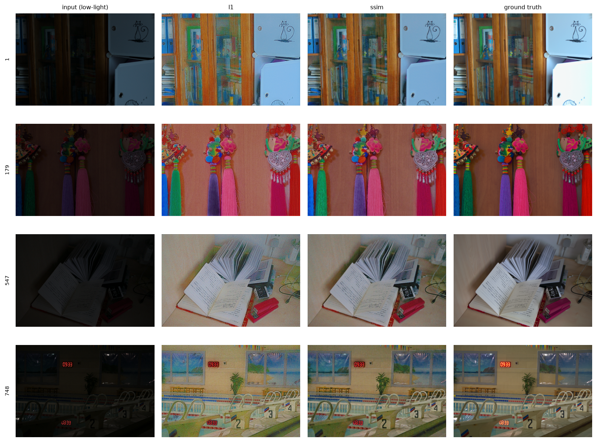

# Retinex-Net in PyTorch, with an SSIM-augmented reconstruction loss

A from-scratch PyTorch reimplementation of **Retinex-Net** (Wei et al., BMVC
2018, *Deep Retinex Decomposition for Low-Light Enhancement*), verified
against the authors' released TensorFlow weights, plus a controlled
experiment: does adding an SSIM term to Enhance-Net's reconstruction loss
improve results — and does it still help **out of distribution**, where the
original paper only ever showed side-by-side pictures?

**What was found.** Adding SSIM to the L1 reconstruction loss improved every
metric measured: +0.43 dB PSNR, +0.127 SSIM, −0.177 LPIPS in-distribution,
and lower (better) NIQE on all three unseen datasets. The more interesting
result is in the baseline: **the paper's own L1 loss makes NIQE *worse* than
the untouched input image on 2 of the 3 cross-datasets.** The L1 model
brightens the image and amplifies noise while doing it, and a no-reference
metric notices. The SSIM variant is the one that actually improves perceived
naturalness rather than just moving pixels toward the training distribution.
On LIME, though, even the SSIM variant beats the raw input by only 0.11 NIQE
— a real but marginal win. See [Discussion](#discussion).

---

## Results

Full table, regenerable with `python scripts/results_table.py`, also at
[`outputs/results_table.md`](outputs/results_table.md). Every metric computed
is shown; nothing is omitted.

| Model | LOL PSNR ↑ | LOL SSIM ↑ | LOL SSIM-gray ↑ | LOL LPIPS ↓ | LOL NIQE ↓ | LIME NIQE ↓ | MEF NIQE ↓ | DICM NIQE ↓ |
|:---|:---:|:---:|:---:|:---:|:---:|:---:|:---:|:---:|
| `input` (no enhancement) | 7.77 | 0.1952 | 0.1937 | 0.5595 | 6.75 | 4.35 | 5.19 | 3.86 |
| **Retinex-Net (L1)** | 18.26 | 0.5949 | 0.6221 | 0.4421 | 5.88 | 5.03 | 4.87 | 4.12 |
| **Retinex-Net (+SSIM)** | **18.68** | **0.7222** | **0.7698** | **0.2651** | **4.64** | **4.24** | **3.74** | **3.05** |
| `tf_reference` (authors' weights) | 16.79 | 0.4189 | 0.5369 | 0.4740 | 8.86 | 4.62 | 5.17 | 4.53 |

Two rows exist so the other two can be read honestly:

- **`input`** is the identity function scored through the same pipeline. NIQE
  is a no-reference metric, so "B beats A" says nothing about whether either
  beat *doing nothing*. Produced by `scripts/input_baseline.py`.
- **`tf_reference`** is the authors' released TensorFlow weights, ported into
  this implementation. It anchors the reimplementation against the published
  model.

### Margin: SSIM variant minus L1 baseline

| Benchmark | Metric | L1 | +SSIM | Δ | better? |
|:---|:---|:---:|:---:|:---:|:---:|
| LOL | PSNR ↑ | 18.26 | 18.68 | +0.43 | ✓ |
| LOL | SSIM ↑ | 0.5949 | 0.7222 | +0.1272 | ✓ |
| LOL | SSIM-gray ↑ | 0.6221 | 0.7698 | +0.1477 | ✓ |
| LOL | LPIPS ↓ | 0.4421 | 0.2651 | −0.1770 | ✓ |
| LOL | NIQE ↓ | 5.88 | 4.64 | −1.24 | ✓ |
| LIME | NIQE ↓ | 5.03 | 4.24 | −0.80 | ✓ |
| MEF | NIQE ↓ | 4.87 | 3.74 | −1.13 | ✓ |
| DICM | NIQE ↓ | 4.12 | 3.05 | −1.07 | ✓ |

### Qualitative



*LOL eval15, evenly-spaced sample (not hand-picked). Input · L1 · +SSIM ·
ground truth.* The metric gap is visible: the L1 column carries the
amplified sensor noise and colour blotching Retinex-Net is known for, and
the SSIM column is markedly cleaner. Cross-dataset grids are in
[`outputs/qualitative/`](outputs/qualitative/), and
`LOL_l1_decomposition.png` shows what the decomposition itself learned
(reflectance, illumination, enhanced illumination).

---

## The hypothesis, stated before the results

L1 reconstruction loss scores every pixel independently, so it is indifferent
to whether the error it leaves behind is *structured*. A prediction that is
uniformly a little too dim and one that has lost all local contrast can carry
identical L1. SSIM compares local luminance, contrast and structure jointly,
so it penalises exactly the failure mode L1 cannot see.

The prediction was that this should help most **out of distribution**. On LOL
there is ground truth to fit, and L1 fits it. On LIME/MEF/DICM there is no
ground truth and no fine-tuning — only whatever notion of "looks right" the
loss instilled transfers. A structure-aware loss should transfer better than
a per-pixel one.

The original paper evaluates exactly these three datasets in Section 4.3 and
reports **no metrics at all** for them, only visual figures. Quantifying that
comparison is this project's contribution over the paper.

---

## Architecture

Implemented from the paper, `models/` — see
[`models/README.md`](models/README.md) for detail.

**Decom-Net** (stage 1) splits an image into 3-channel reflectance `R` and
1-channel illumination `I`, both sigmoid-bounded, such that `S ≈ R · I`. The
same weights process the low-light and normal-light image of a pair; the
pairing enters only through the loss. 208K parameters.

**Enhance-Net** (stage 2) takes the frozen low-light decomposition and
predicts an enhanced illumination map `Î`; the output is `R_low · Î`. Three
stride-2 down-sampling blocks, three **resize-convolution** up-sampling
blocks (nearest-neighbour + stride-1 conv — the paper cites Odena et al. 2016
to avoid checkerboard artifacts), **additive** skip connections (not U-Net
concatenation), and a multi-scale concatenation that fuses all three decoder
scales through a 1×1 conv. 237K trainable parameters.

The structure-aware smoothness term is what makes the decomposition work:

```
L_is = mean( |∇I| · exp(−λ_g · |∇R|) )
```

Plain total variation is *structure-blind* — it penalises every illumination
gradient equally, smooths across real object boundaries, and leaves their
edges baked into the illumination map instead of the reflectance. The
`exp(−λ_g·∇R)` weight collapses the penalty toward zero wherever reflectance
has a strong edge, which is precisely where illumination *is* allowed to be
discontinuous.

### The reimplementation is verified, not asserted

```bash
python scripts/verify_port.py     # passes to within one 8-bit level
```

The authors' released TensorFlow weights are transplanted into these PyTorch
classes and the outputs compared against the original TensorFlow graph. They
agree to **1.4e-05** (float32 round-off).

This caught a real bug. PyTorch's ordinary symmetric `padding=1` on a
stride-2 3×3 conv is **not** TensorFlow's `SAME`, which pads bottom/right
only when the input is even. With symmetric padding the transplanted weights
differed from the reference by up to **0.27** out of 1.0 — and still produced
a plausible-looking enhanced image. A visual check would not have caught it.
The negative control is part of the test:

```bash
python scripts/verify_port.py --padding-mode symmetric   # FAILS, by design
```

As a second anchor, the ported weights score **PSNR 16.79** on LOL eval15
against the **16.77** widely published for RetinexNet — so the metric
pipeline reproduces the paper too, not just the architecture.

---

## Method

Everything below is identical between the two arms except the single loss
weight.

| | |
|---|---|
| Training data | LOL `our485` (485 real pairs) + `syn` (1000 synthetic) = 1485 |
| Evaluation | LOL `eval15` (15 pairs), the authors' canonical split |
| Cross-dataset | LIME (10), MEF (79), DICM (44) — unpaired, no ground truth |
| Patches | 96×96 random crops, 8 dihedral augmentations |
| Batch size | 16 |
| Optimizer | Adam, lr 1e-3, ×0.1 at epoch 20 |
| Epochs | 100 per stage, fixed budget, no early stopping |
| Hardware | RTX 2050 (4 GB); ~33 min stage 1, ~15 min per stage-2 arm |

**The only difference between arms** is `loss.ssim_weight`: `0.0` for the
baseline, `1.0` for the variant. `L1` stays at 1.0 in both — the terms are
augmentative, so the variant sees strictly more signal, not different signal.

```
L = 1.0 · ‖R_low·Î − S_normal‖₁  +  ssim_weight · (1 − SSIM(R_low·Î, S_normal))
                                 +  3.0 · L_is(Î, R_low)
```

Four things enforce the control, and three of them are checkable:

1. **One Decom-Net.** Trained once; both arms load the same checkpoint and
   freeze it. If each arm trained its own decomposition, the comparison would
   measure two differently-decomposed models rather than two losses.
2. **One loss class.** `EnhanceLoss` covers both arms via a weight, not two
   classes, so an unrelated difference cannot drift into the variant. At
   `ssim_weight=0` it does not even import `pytorch_msssim`.
3. **Identical data, verified.** `python scripts/check_determinism.py` hashes
   the DataLoader's batches under the same seed twice and confirms they match,
   with a different-seed negative control.
4. **`diff configs/enhance_l1.yaml configs/enhance_ssim.yaml`** shows exactly
   two substantive differences: the output directory and `ssim_weight`.

Point 3 exists because it initially failed. The dataset drew crops from
`np.random.default_rng()`, which seeds itself from OS entropy and silently
ignored the configured seed — every run saw a different crop stream, nothing
crashed, and the docs claimed otherwise. Both arms were retrained after the
fix.

### Where the paper and the released code disagree

Two loss weights differ. The configs follow the **released code**, since that
is what produced the published results, and both arms use the same values.

| term | paper | released code | used here |
|---|:---:|:---:|:---:|
| invariable reflectance `λ_ir` | 0.001 | 0.01 | 0.01 |
| Enhance-Net smoothness | 1.0 | 3.0 | 3.0 |
| cross-reconstruction `λ_ij` | 0.001 | 0.001 | 0.001 |
| illumination smoothness `λ_is` | 0.1 | 0.1 | 0.1 |
| gradient sensitivity `λ_g` | 10 | 10 | 10 |

The paper's Decom-Net description ("5 convolutional layers") also reads as 3
activated convs, while the released code uses 5 between a 9×9 shallow conv
and a 3×3 reconstruction conv. The released reading is used; `layer_num`
switches it.

### A protocol trap worth knowing about

The SSIM widely published for RetinexNet on LOL (0.560) is a **grayscale**
number. Measured on the authors' own weights through this pipeline:

| protocol | value |
|---|---:|
| RGB, matlab-equivalent | 0.4189 |
| grayscale, matlab-equivalent | 0.5369 |
| *published* | *0.560* |

Quoting an RGB SSIM against the published figure would look like a 0.14
regression that is entirely convention. Both columns are therefore reported.
`SSIM` (RGB) is primary because it is what the SSIM loss actually optimises;
`SSIM-gray` is the literature-comparable one.

---

## Discussion

**The SSIM term helps, and it helps most where it was predicted to.** The
in-distribution gains are real but modest in PSNR (+0.43 dB) and large in the
structural and perceptual metrics (+0.127 SSIM, −0.177 LPIPS). That pattern
is itself the point: PSNR is a per-pixel metric and the two arms have almost
identical training L1 (0.1116 vs 0.1114). The SSIM term did not make the
model fit pixels better — it changed *how* the residual error is distributed,
and the metrics that can see structure register it while PSNR barely does.

**The most interesting number is in the baseline, not the variant.** Against
the unenhanced input, the paper's L1 model makes NIQE *worse* on two of three
cross-datasets:

| | input | L1 | +SSIM |
|---|:---:|:---:|:---:|
| LIME | 4.35 | 5.03 ✗ | 4.24 ✓ |
| MEF | 5.19 | 4.87 ✓ | 3.74 ✓ |
| DICM | 3.86 | 4.12 ✗ | 3.05 ✓ |

The L1 model brightens the image and amplifies sensor noise while doing it,
and a natural-scene-statistics metric penalises that more than it rewards the
extra visibility. This is consistent with what the qualitative grids show and
with Retinex-Net's known noise behaviour — the paper itself proposes an
optional BM3D denoising step for exactly this reason. Without the `input`
row, the cross-dataset table would read as "both models work, one works
better," which would be wrong.

**Do not oversell the LIME result.** The SSIM variant improves LIME NIQE from
4.35 to 4.24 — a 0.11 margin over doing nothing, on 10 images. That is not a
meaningful win. MEF (−1.44) and DICM (−0.81) versus input are substantial;
LIME is essentially a wash. LIME is also the dataset whose inputs are least
dark to begin with, which is a plausible explanation: there is less headroom
for enhancement to add value and just as much for it to add noise.

**Why the SSIM term reduces noise.** SSIM's contrast and structure terms are
computed over local windows. Additive noise depresses local structural
correlation without changing local means much, so a noisy prediction is
penalised by SSIM in a way it is not by L1. The training logs corroborate the
mechanism: the SSIM arm's illumination smoothness loss settles 3.6× *higher*
(0.0160 vs 0.0045), meaning it produces a **less** smooth illumination map.
It is not winning by blurring — it is spending the smoothness budget
differently, keeping structure where L1 would have flattened it.

**This is a single seed.** Every number is one training run per arm. The
in-distribution margins (0.13 SSIM, 0.18 LPIPS) are far larger than
run-to-run noise would plausibly explain, and the cross-dataset direction is
consistent across three independent datasets and 133 images, which is the
stronger evidence. But no error bars are reported and none should be inferred.

**Our L1 baseline beats the authors' released checkpoint** (18.26 vs 16.79
PSNR). The likely cause is patch size: this project trains at 96×96 per the
paper's text, while the released code defaults to 48×48. That was not
investigated, and it means the baseline here is a *strong* one — the SSIM
variant's margin is measured over a baseline that already exceeds the
published model, not against a weakened one.

---

## Limitations

- **One seed, no error bars.** The highest-value next step is 3–5 seeds per
  arm. Everything needed is already wired: `--set experiment.seed=N`.
- **No λ_ssim sweep.** `λ_ssim = 1.0` was the first value tried and was not
  tuned. `--set loss.ssim_weight=...` runs the sweep; the fact that the first
  value worked means the reported margin is a lower bound, not a tuned peak.
- **No denoising.** BM3D on reflectance is in the paper as a secondary
  contribution and was deliberately skipped. Given that the headline finding
  is about *noise amplification*, this is the most substantively interesting
  omission — a denoised L1 baseline might close much of the cross-dataset gap,
  and that is the experiment I would run next.
- **NIQE is not human judgement.** It is a statistical proxy. A small user
  study, or at least LPIPS against a reference-free proxy, would be stronger.
- **Cross-dataset sizes differ from the paper's text.** The paper cites LIME
  10 / MEF 17 sequences / DICM 69; the redistributed `Test.zip` bundle has
  10 / 79 / 44. Counts are recorded in every `summary.json`. Both arms see
  identical images, so the comparison is unaffected, but the absolute NIQE
  values are not directly comparable to a paper using a differently-sized set.
- **Not tested on the motivating use case.** Real surveillance or industrial
  footage — with motion blur, compression artifacts, and IR illumination —
  is a different distribution again from any of these benchmarks.
- **Weights are not bit-reproducible.** The *data* stream is deterministic and
  verified, but cuDNN kernel selection is not, so re-running gives
  statistically equivalent rather than identical weights.

---

## Repository layout

Structured to match
[lane-detection-benchmark](https://github.com/Thiruvavinan/lane-detection-benchmark):
every model plugs into the same pipeline, and changing the architecture does
not require touching training, evaluation, or visualisation code. **Every
folder has a README answering "why does this folder exist?"**

```
configs/      one YAML per run; the two arms differ in 2 lines
data/         dataset loaders + prepare_data.py output (gitignored)
models/       architectures only — no training, loss or metric code
training/     trainer, losses, optimizers, gradient diagnostics
evaluation/   metric wrappers + the scoring engine
scripts/      thin CLI entry points
docs/         TF reference renders the port test checks against
outputs/       results table, qualitative grids (gitignored)
runs/         checkpoints + history.json per run (gitignored)
```

The project brief specified a flatter layout (`train_decom.py`, `losses.py`
at root). This uses the benchmark layout instead, per the repo-structure
requirement; the mapping is `scripts/train.py --config configs/decom.yaml` for
`train_decom.py`, `--config configs/enhance_{l1,ssim}.yaml` (or
`--loss {l1,ssim}`) for `train_enhance.py`, `scripts/evaluate.py` for
`eval.py`, and `training/losses.py` for `losses.py`.

---

## Reproducing

```bash
python -m venv .venv && .venv/Scripts/pip install -r requirements.txt

# Put LOLdataset.zip, BrighteningTrain.zip and Test.zip in the repo root
python scripts/prepare_data.py

python scripts/train.py --config configs/decom.yaml          # stage 1, once
python scripts/train.py --config configs/enhance_l1.yaml     # baseline
python scripts/train.py --config configs/enhance_ssim.yaml   # variant

python scripts/evaluate.py --checkpoint runs/enhance_l1/last.pth   --tag l1 --save-decomposition
python scripts/evaluate.py --checkpoint runs/enhance_ssim/last.pth --tag ssim --save-decomposition
python scripts/input_baseline.py --tag input
python scripts/results_table.py --tags input l1 ssim --margin l1 ssim

python scripts/visualize_predictions.py --benchmark LOL --tags l1 ssim --n 4
```

Checks worth running:

```bash
python scripts/check_determinism.py    # both arms see identical training data
python scripts/verify_port.py          # matches the original TF graph
```

`scripts/verify_port.py` needs `checkpoints/tf_reference.pth`; see
`scripts/convert_tf_weights.py` for the two-environment procedure that builds
it from the authors' release.

---

## Extras beyond the brief

- **Per-module gradient diagnostics** (`training/diagnostics.py`, off by
  default, `--set training.grad_log_every=50`). Reports gradient norms per
  module group rather than one global number, because a single norm hides ten
  dead layers behind one large one. The key readout is `grad_norm/spread`,
  largest group over smallest.

  Both stages trained cleanly, zero warnings. Stage-2 spread was 5.6 (L1) and
  10.9 (SSIM) over the full 100-epoch runs. The Decom-Net figure (spread 2.3;
  shallow 0.68 / activated 0.85 / recon 0.45) comes from a separate 3-epoch
  probe — the 100-epoch stage-1 run predates a fix to the group labelling and
  recorded only a single collapsed group. One real observation: in both stage-2 arms
  `enhance.up` is consistently the *least*-gradient group, receiving 4–11×
  less than `enhance.conv0` and `enhance.down` (L1: 0.093 vs 0.525 / 0.496;
  SSIM: 0.122 vs 1.330 / 0.473). The additive skip connections let gradient
  bypass the decoder convs. Not pathological, but it suggests extra decoder
  capacity is unlikely to pay off — and it is invisible from a loss curve.

- **Optional normalisation** (`models/norm.py`, default `none` as published).
  GroupNorm rather than BatchNorm is the one to try here: training is
  batch=16 on 96×96 crops while inference is batch=1 on whole images, and the
  cross-dataset evaluation is a deliberate distribution shift — BatchNorm's
  running statistics come from LOL and would mis-normalise exactly the case
  being measured, confounding the headline result with a BatchNorm artifact.
  Caveat in [`models/README.md`](models/README.md): absolute brightness is
  signal here, not a nuisance variable, so normalising Decom-Net may hurt.

- **Architecture variations worth trying**, written up in
  [`models/README.md`](models/README.md) — note that the two usual
  suggestions (stride-conv instead of maxpool; resize-conv instead of
  transposed conv) are *already* what the paper does.

---

## Reference

```bibtex
@inproceedings{Chen2018Retinex,
  title={Deep Retinex Decomposition for Low-Light Enhancement},
  author={Chen Wei and Wenjing Wang and Wenhan Yang and Jiaying Liu},
  booktitle={British Machine Vision Conference},
  year={2018}
}
```

Original TensorFlow implementation: <https://github.com/weichen582/RetinexNet> (MIT).
