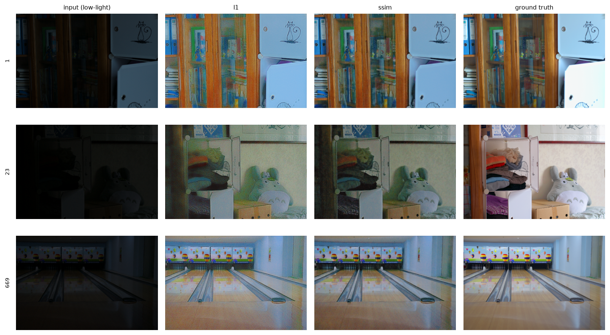
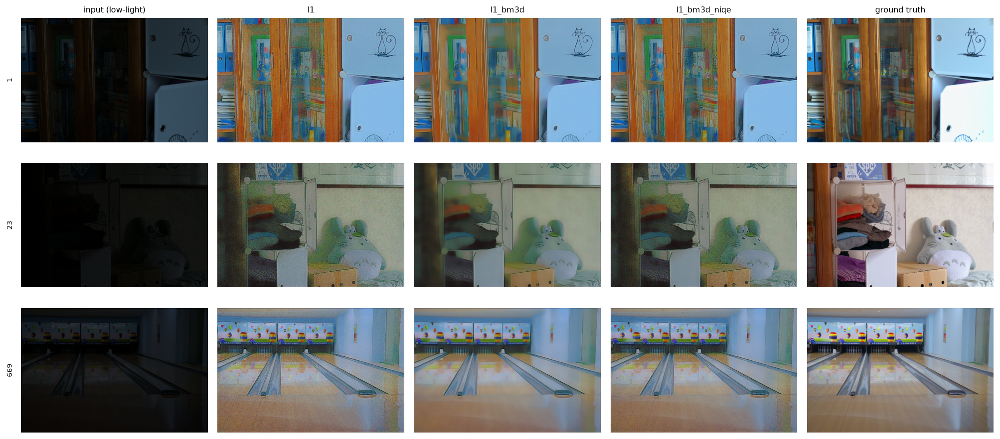
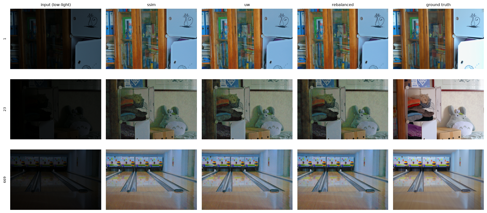

# Retinex-Net in PyTorch — what actually improves it?

A from-scratch PyTorch reimplementation of **Retinex-Net** (Wei et al., BMVC
2018), verified against the authors' released TensorFlow weights, plus three
separate experiments on the loss — evaluated in-distribution **and across three
unseen datasets**, which the original paper compares only with pictures.

| | question | answer |
|---|---|---|
| **1** | Does an SSIM reconstruction term help? | Yes, substantially, and most on the unseen datasets. |
| **2** | Does *learning* the loss weights beat hand-setting them? | It finds better weights; it does not beat a fixed config at those same weights. |
| **3** | Does the paper's BM3D denoising help? | In-distribution yes; cross-dataset never, at any strength tested. |

Read together (§4) they say something none of them says alone: **BM3D
reproduces ~85% of Experiment 1's in-distribution gain and none of its
cross-dataset gain.**

**Protocol.** LOL `eval15` is paired, so it carries full-reference metrics
(PSNR / SSIM / LPIPS-Alex). LIME / MEF / DICM are unpaired and unseen during
training, so they carry NIQE only — which is why the identity row is reported:
a no-reference score is uninterpretable without it. SSIM is RGB and
channel-averaged; the luma variant, which is what the 0.560 usually quoted for
Retinex-Net refers to, differs by ~0.12 and is in the
[full table](outputs/results_table.md). All four loss configurations share a
frozen Decom-Net, seed, data order and 100-epoch budget; data-order equivalence
is asserted by `scripts/check_determinism.py`, not assumed.

---

## Experiment 1 — does an SSIM reconstruction term help?

L1 vs L1 + SSIM. Nothing else changes. No denoising anywhere in this table.

| Model | LOL PSNR &uarr; | LOL SSIM &uarr; | LOL LPIPS &darr; | LIME NIQE &darr; | MEF NIQE &darr; | DICM NIQE &darr; |
|:---|:---:|:---:|:---:|:---:|:---:|:---:|
| *Identity (no enhancement)* | 7.77 | 0.1952 | 0.5595 | 4.35 | 5.19 | 3.86 |
| *Wei et al. released weights* | 16.79 | 0.4189 | 0.4740 | 4.62 | 5.17 | 4.53 |
| **L1 recon** — the paper | 18.26 | 0.5949 | 0.4421 | 5.03 | 4.87 | 4.12 |
| **L1 + SSIM** | **18.68** | **0.7222** | **0.2651** | **4.24** | **3.74** | **3.05** |

**Finding: yes, and the gain is structural rather than per-pixel** — PSNR moves
+0.42 dB while SSIM moves +0.127 and LPIPS −0.177, and all three cross-datasets
improve.

Two things the identity row makes visible. The paper's L1 baseline is
**NIQE-worse than doing nothing** on LIME (5.03 vs 4.35) and DICM (4.12 vs
3.86) — `R = S / I` amplifies sensor noise by ~`1/I` in dark regions, and
NSS-based scoring penalises that more than it rewards the added visibility. The
SSIM configuration is the one that actually beats the untouched input.



*LOL eval15. The L1 column carries the amplified sensor noise; the SSIM column
is visibly cleaner at the same brightness. Cross-dataset versions of this grid:
[LIME](outputs/qualitative/LIME_exp1_ssim.png),
[MEF](outputs/qualitative/MEF_exp1_ssim.png),
[DICM](outputs/qualitative/DICM_exp1_ssim.png).*

---

## Experiment 2 — is *learning* the loss weights better than setting them?

Homoscedastic uncertainty weighting (Kendall et al. 2018) against the hand-set
1 : 1 : 3, and against a fixed configuration at the ratios the learned run
converged to.

| Model | LOL PSNR &uarr; | LOL SSIM &uarr; | LOL LPIPS &darr; | LIME NIQE &darr; | MEF NIQE &darr; | DICM NIQE &darr; |
|:---|:---:|:---:|:---:|:---:|:---:|:---:|
| L1 + SSIM, hand-set 1 : 1 : 3 | 18.68 | 0.7222 | 0.2651 | 4.24 | 3.74 | 3.05 |
| **uncertainty-weighted** *(learned)* | 19.05 | 0.7542 | 0.2215 | **3.94** | 3.50 | **2.69** |
| **fixed 1.00 : 0.65 : 0.70** | **19.11** | **0.7627** | **0.2055** | 4.00 | **3.47** | **2.69** |

**Finding: learning found better weights; learning was not needed to use
them.** Uncertainty weighting converged to `1.00 : 0.65 : 0.70` — SSIM wants
*less* weight than L1, and smoothness wants 0.70 rather than the reference
implementation's 3.0. Both beat the hand-set 1 : 1 : 3. But the fixed
configuration matches or beats the learned one on 5 of 6 metrics.

**The fixed weights were copied from the learned run, not found
independently.** That is the honest ordering: uncertainty weighting is what
*discovered* `1.00 : 0.65 : 0.70`, and this row only shows the machinery is
unnecessary once you know the answer. It is not evidence that hand-tuning would
have found those ratios.

On Decom-Net the method found nothing at all: with all five terms learned,
every weight scaled **13× uniformly** and the ratios stayed within **3%** of
the paper's — an independent validation of Wei et al.'s constants, and a
negative result for the method, since a global scale is absorbed by the
learning rate.

---

## Experiment 3 — does the paper's BM3D denoising help?

Every model from Experiments 1 and 2, scored with the denoiser off and on.
BM3D is applied to reflectance before recombination with Î, with
illumination-relative strength `w = (1 − I)^γ`. σ and γ are tuned per model on
**training** pairs, never on an evaluation set.

**Without denoising:**

| Model | LOL PSNR &uarr; | LOL SSIM &uarr; | LOL LPIPS &darr; | LIME NIQE &darr; | MEF NIQE &darr; | DICM NIQE &darr; |
|:---|:---:|:---:|:---:|:---:|:---:|:---:|
| L1 recon — the paper | 18.26 | 0.5949 | 0.4421 | 5.03 | 4.87 | 4.12 |
| L1 + SSIM | 18.68 | 0.7222 | 0.2651 | 4.24 | 3.74 | 3.05 |
| uncertainty-weighted | 19.05 | 0.7542 | 0.2215 | 3.94 | 3.50 | 2.69 |
| fixed 1.00 : 0.65 : 0.70 | 19.11 | 0.7627 | 0.2055 | 4.00 | 3.47 | 2.69 |

**With BM3D (σ tuned per model on LPIPS):**

| Model | LOL PSNR &uarr; | LOL SSIM &uarr; | LOL LPIPS &darr; | LIME NIQE &darr; | MEF NIQE &darr; | DICM NIQE &darr; |
|:---|:---:|:---:|:---:|:---:|:---:|:---:|
| L1 recon — the paper | 18.54 | 0.7734 | 0.2323 | 5.15 | 5.53 | 4.42 |
| L1 + SSIM | 18.79 | 0.7910 | 0.1900 | 4.47 | 3.91 | 3.21 |
| uncertainty-weighted | 19.07 | 0.7717 | 0.2059 | 4.09 | 3.59 | 2.76 |
| fixed 1.00 : 0.65 : 0.70 | 19.13 | 0.7773 | 0.1947 | 4.09 | 3.51 | 2.71 |

In-distribution every model improves — denoising nearly doubles the L1
configuration's LOL SSIM (0.595 → 0.773) — and cross-dataset every model
degrades. To test whether that was the denoiser or the *tuning objective*,
σ was re-tuned on **NIQE**, which needs no ground truth and so is still
leak-free on training images:

| model | σ = 0 (none) | LPIPS-tuned σ | NIQE-tuned σ = 0.04 |
|:---|:---:|:---:|:---:|
| L1 recon | **4.67** | 5.03 *(&sigma;=0.16)* | 4.78 |
| L1 + SSIM | **3.68** | 3.86 *(&sigma;=0.08)* | 3.80 |
| uncertainty-weighted | **3.38** | 3.48 *(&sigma;=0.02)* | 3.56 |
| fixed rebalanced | **3.38** | 3.44 *(&sigma;=0.02)* | 3.52 |

**Finding: BM3D never helps out of distribution, at any strength tested.**
Eight denoised configurations — four models × two independently chosen σ — and
all eight are worse cross-dataset than not denoising. For every model the
relationship is **monotonic in σ**, with the optimum at zero. The tuning
objective changed *how much* harm, not *whether* there was harm.

**The mechanism is domain shift**, and one detail pins it. LPIPS-optimal σ
varies 8× across models (0.16 → 0.02) because it is correcting *the model*: a
noisier output wants more smoothing. NIQE-optimal σ is **0.04 for all four**,
because it responds to the *input sensor noise*, which is identical in every
case. A σ set by LOL's noise has no reason to suit LIME, MEF or DICM — and
measured on held-out LOL images it transfers fine (−0.41 on the tuning set,
−0.42 on eval15). It fails only when the dataset changes.

That points at the fix this project did not try: estimate σ per dataset, or per
image from the input's own noise, rather than fitting one value on LOL.



*Denoiser off, then LPIPS-tuned σ=0.16, then NIQE-tuned σ=0.04. The LPIPS
setting is visibly the most smoothed — which is what it was selected to be, and
why NIQE scores it worst.*

---

## 4. How the three connect

Experiment 3 is not just a negative result about denoising — it measures how
much of Experiment 1's gain was noise suppression all along. Applying BM3D to
*every* loss configuration collapses the spread between them:

| Metric | spread without BM3D | spread with BM3D | absorbed |
|:---|:---:|:---:|:---:|
| LOL LPIPS &darr; | 0.2366 | 0.0423 | **+82%** |
| LOL SSIM &uarr; | 0.1678 | 0.0192 | **+89%** |
| cross-dataset NIQE &darr; | 1.2936 | 1.5976 | **-24%** |

**On LOL a generic denoiser reproduces ~85% of what the loss change bought** —
denoise all four and they are close to interchangeable, and the LPIPS ranking
even reorders. **Cross-dataset the spread does not collapse at all.**

So the SSIM term's in-distribution advantage is largely noise suppression,
which an off-the-shelf denoiser also provides. Its out-of-distribution
advantage is something else, and it survives denoising. That makes the
cross-dataset column the one that actually justifies the loss change — and it
is exactly the column the original paper reports only as side-by-side pictures.



*All samples are evenly spaced across the benchmark, never hand-picked.
Thirteen grids covering **every** model in the results table — including the
Decom-Net variants, the ported reference weights, and the learned
decomposition itself — are in
[`outputs/qualitative/`](outputs/qualitative/), regenerated by
`scripts/make_qualitative.py`, which fails if any evaluated model is not
pictured somewhere.*

**What not to read into it.** One seed per configuration, no error bars. BM3D
σ was tuned on training images the network had already seen. Cross-dataset
counts (LIME 10 / MEF 79 / DICM 44) differ from the paper's text, so absolute
NIQE is not comparable to papers using other bundles — though every
configuration sees identical images, so the comparison between them holds. And
this L1 baseline *beats* the authors' released checkpoint (18.26 vs 16.79
PSNR), most likely from training at 96×96 patches rather than the released
code's 48×48 default, so the margins sit on top of a strong baseline.

The L1 and L1+SSIM runs also end at almost identical training L1 (0.1116 vs
0.1114), which is what "structural rather than per-pixel" means concretely:
the SSIM term did not fit pixels better, it changed how the residual error is
distributed.

---

## Technique

**Decom-Net** splits an image into 3-channel reflectance `R` and 1-channel
illumination `I`, both sigmoid-bounded, so `S ≈ R · I`. Shared weights process
the low- and normal-light image of a pair; the pairing enters only through the
loss. **Enhance-Net** takes the frozen low-light decomposition and predicts an
enhanced illumination map `Î`, output `R_low · Î` — encoder-decoder with
stride-2 down-sampling, resize-convolution up-sampling (not transposed conv),
additive skips (not concatenation), and multi-scale fusion of all three decoder
scales. 445K parameters.

The term that makes the decomposition work is a structure-aware smoothness
penalty, `mean(|∇I| · exp(−λ_g·|∇R|))`. Plain total variation is
structure-blind and smooths across object boundaries, leaving their edges baked
into the illumination map; the exponential weight releases the penalty exactly
where reflectance has a strong edge.

**The four loss configurations** differ only in the Enhance-Net reconstruction
loss, over a shared frozen Decom-Net, same seed, same 100-epoch budget:

```
L = w_l1·‖R_low·Î − S_normal‖₁ + w_ssim·(1 − SSIM(R_low·Î, S_normal)) + w_sm·L_is(Î, R_low)
```

| configuration | w_l1 | w_ssim | w_sm |
|---|:---:|:---:|:---:|
| L1 recon (paper) | 1.0 | 0 | 3.0 |
| L1 + SSIM | 1.0 | 1.0 | 3.0 |
| uncertainty-weighted | *learned* | *learned* | 3.0 |
| fixed rebalanced | 1.0 | 0.65 | 0.70 |

**The port is verified, not asserted.** `scripts/verify_port.py` transplants
the authors' TensorFlow weights into these classes and diffs against the
original graph — they agree to **1.4e-05**. That test caught a real bug:
PyTorch's symmetric `padding=1` on a stride-2 conv is not TensorFlow's `SAME`,
and the mismatch produced outputs off by 0.27/1.0 that still looked like
plausible enhanced images. `scripts/check_determinism.py` separately proves
every configuration sees identical training data.

---

## Repository

Structured so every model plugs into the same pipeline — changing an
architecture does not touch training, evaluation or visualisation code. Each
folder has a README explaining why it exists.

| folder | contents |
|---|---|
| [`configs/`](configs/) | one YAML per run; the loss configurations differ in a couple of lines |
| [`data/`](data/) | dataset loaders and split definitions |
| [`models/`](models/) | architectures, port verification, variations worth trying |
| [`training/`](training/) | trainer, losses, learned weighting, gradient diagnostics |
| [`evaluation/`](evaluation/) | metric wrappers, BM3D denoising, scoring engine |
| [`scripts/`](scripts/) | CLI entry points |

```bash
python -m venv .venv && .venv/Scripts/pip install -r requirements.txt
python scripts/prepare_data.py            # needs the 3 dataset zips in the repo root

python scripts/train.py --config configs/decom.yaml             # stage 1, once
python scripts/train.py --config configs/enhance_l1.yaml        # paper baseline
python scripts/train.py --config configs/enhance_ssim.yaml      # + SSIM term
python scripts/train.py --config configs/enhance_uw.yaml        # + learned weights
python scripts/train.py --config configs/enhance_rebalanced.yaml # + fixed rebalanced

python scripts/evaluate.py --checkpoint runs/enhance_l1/last.pth --tag l1
python scripts/input_baseline.py --tag input
python scripts/results_table.py
```

Optional BM3D on any checkpoint: `--denoise bm3d --denoise-sigma S --denoise-gamma G`,
with `scripts/tune_denoise.py` selecting `S`/`G` on training pairs. Per-module
gradient diagnostics (`--set training.grad_log_every=50`) and optional GroupNorm
(`--set model.norm=group`) are available, both off by default so the published
architecture stays the default path.

---

Retinex-Net: Wei, Wang, Yang & Liu, *Deep Retinex Decomposition for Low-Light
Enhancement*, BMVC 2018. Original TensorFlow implementation:
<https://github.com/weichen582/RetinexNet> (MIT).
